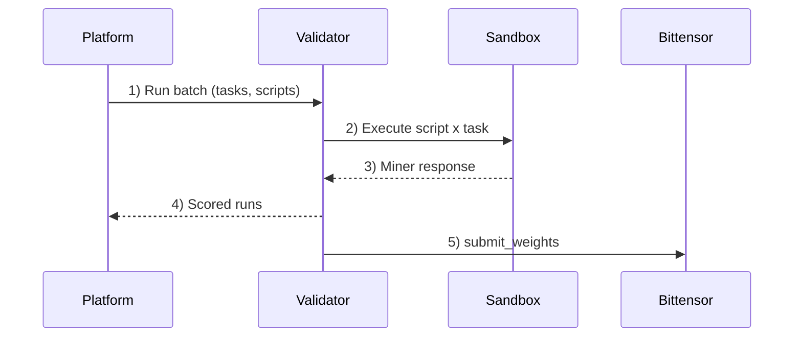

# Caster Subnet

**Consensus made scalable.**

Caster Subnet is a Bittensor subnet that evaluates generic query-answering scripts by running miner code in validator sandboxes. Validators compare miner responses against reference answers, aggregate scores, and submit weights on-chain.

## Start here

- **Validator operators**: see [`validator/README.md`](validator/README.md)
- **Miner developers**: see [`miner/README.md`](miner/README.md)
- **Miner SDK reference**: see [`packages/miner-sdk/README.md`](packages/miner-sdk/README.md)

## Install dependencies (local dev)

```bash
uv sync --all-packages --dev
```

## How evaluation works (roles + flow)

Caster rewards the best miner scripts by having validators run standardized query tasks against them, aggregating scores, and assigning emissions to a sticky top-3 roster.

A **task** is one generic query plus one reference answer.

<details>
<summary><strong>Exact task contract (JSON)</strong></summary>

Miners implement the `query` entrypoint. Validators call it with this payload:

```json
{
  "text": "Caster Subnet validators manage sandboxed miners."
}
```

Your script must return:

```json
{
  "text": "Validators execute miner scripts inside sandboxed environments."
}
```

Notes:
- Requests and responses are plain text wrapped in typed objects so the contract can expand later without breaking the entrypoint shape.

**Dig deeper**
- [Miner entrypoint contract (SDK)](packages/miner-sdk/README.md#query-contract)
- [Flow: miner-task batch](docs/api/flows.md#miner-task-batch)
- [Flow: tool execution](docs/api/flows.md#tool-execution)
- [API auth conventions + index](docs/api/README.md)
</details>

**How the evaluation dataset is built**
- The platform generates batches of realistic standalone user queries.
- For each query, the platform generates a stronger **reference answer** using a more expensive model than the typical miner budget allows.
- Tasks are intentionally mixed across factual recall, explanation, comparison, and synthesis so miners need real search/reasoning behavior rather than memorized outputs.

**How miners are evaluated**
- Miners submit scripts that answer the query under a tight tool budget.
- Validators score each response against the reference answer with:
  - `comparison_score`: pairwise judge vs reference answer, run twice with swapped order
  - `similarity_score`: embedding cosine similarity between response text and reference-answer text
  - `total_score = 0.5 * comparison_score + 0.5 * similarity_score`
- Candidate totals are aggregated across validators, and ties prefer lower total tool cost.

**Validator flow + gating**
- The platform sends miner-task batches to validators; validators run script x task combinations and report scored runs.
- Validators that are "functioning" can query the latest weights for on-chain emission submission.

**Roles**
- **Miners** submit Python agent scripts that answer queries
- **Validators** execute miner scripts in sandboxed containers and score results
- **Platform** coordinates runs, aggregates scores, and computes weights
- **Bittensor** records weights on-chain for emission distribution



## What we optimize for

- **Cost-efficient and permissionless** — open participation under explicit budget constraints
- **Measurable and transparent** — scripts, monitoring, and scoring rules are visible
- **Competitive and adaptive** — the dataset and sticky roster keep miners improving over time

## Sticky roster keeps incentives honest

We open-source miner scripts. Without a guardrail, a copycat can clone the current best script and win #2/#3 with minimal changes.

The sticky top-3 roster prevents that:

- Only a challenger that beats the current #1 can enter the roster.
- If a challenger does **not** beat #1, the roster stays unchanged.
- If a challenger beats #1, the roster shifts: challenger -> #1, old #1 -> #2, old #2 -> #3.

## Repo layout

```text
public/
  miner/                # miner-facing CLI tooling (test + submit)
  validator/            # validator runtime + operator docs
  sandbox/              # sandbox runtime (run by validators, not miners)
  packages/
    miner-sdk/          # SDK imported by miner scripts
    commons/            # shared utilities (sandbox runner, tools, etc.)
```
