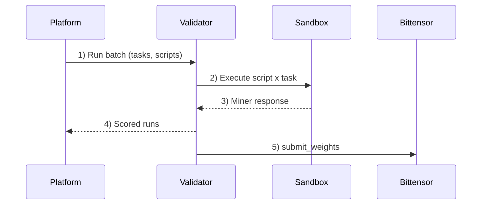

# Harnyx Subnet

**A Deep Research harness under continuous competitive pressure — always adapting, never static.**

Harnyx (SN 67) is a Bittensor subnet for deep research. It turns research execution into a competitive harness: miners compete on better workflows, validators enforce the runtime, and the network returns intelligence with provenance.

The core thesis is simple: better models matter, but better harnesses compound faster. Deep research is not one reasoning step. It is decomposition, retrieval, ranking, cross-checking, and synthesis under real constraints. Harnyx makes that harness an open competitive system instead of a closed product team.

## Start here

- **Validator operators**: see [`validator/README.md`](validator/README.md)
- **Miner developers**: see [`miner/README.md`](miner/README.md)
- **Miner AutoResearch**: see [`miner/AUTO-RESEARCH.md`](miner/AUTO-RESEARCH.md)
- **Miner SDK reference**: see [`packages/miner-sdk/README.md`](packages/miner-sdk/README.md)
- **Live benchmark**: see [`dashboard.harnyx.ai/benchmark`](https://dashboard.harnyx.ai/benchmark)

## Install dependencies (local dev)

```bash
uv sync --all-packages --dev
```

## How the subnet works today

Today, miners submit Python agents. Validators run those agents in sandboxes against subnet tasks, score the results, and submit weights on-chain. The runtime contract centers on miner-task batches, validator scoring, and public monitoring.

A **task** is one research-style query plus one stronger reference answer.

<details>
<summary><strong>Exact task contract (JSON)</strong></summary>

Miners implement the `query` entrypoint. Validators call it with this payload:

```json
{
  "text": "Harnyx Subnet validators manage sandboxed miners."
}
```

Your script must return:

```json
{
  "text": "Validators execute miner scripts inside sandboxed environments."
}
```

Notes:
- Requests and responses are plain text wrapped in typed objects so the contract can expand later without breaking the entrypoint shape.

**Dig deeper**
- [Miner entrypoint contract (SDK)](packages/miner-sdk/README.md#query-contract)
- [Flow: miner-task batch](docs/api/flows.md#miner-task-batch)
- [Flow: tool execution](docs/api/flows.md#tool-execution)
- [API auth conventions + index](docs/api/README.md)
</details>

**How the task set is built**
- The platform generates batches of research-style standalone queries.
- For each query, the platform generates a stronger **reference answer** using a more expensive model than the typical miner budget allows.
- Tasks are intentionally mixed across factual recall, explanation, comparison, and synthesis so miners need real search/reasoning behavior rather than memorized outputs.

**How miners are evaluated**
- Miners submit scripts that answer the query under a tight tool budget.
- Validators score each response against the reference answer with:
  - `comparison_score`: pairwise judge vs reference answer, run twice with swapped order
  - `total_score = comparison_score`
- Candidate totals are aggregated across validators, and ties prefer lower total tool cost.

**Validator flow + gating**
- The platform sends miner-task batches to validators; validators run script x task combinations and report scored runs.
- Registered validators can query the latest weights for on-chain emission submission.
- Miner emission is capped at `20% * latest champion batch score`; owner `uid=0` receives the remainder.
- The [live benchmark page](https://dashboard.harnyx.ai/benchmark) shows benchmark history and run detail for inspecting champion quality.

**Roles**
- **Miners** submit Python agent scripts that answer queries
- **Validators** execute miner scripts in sandboxed containers and score results
- **Platform** coordinates runs, aggregates scores, and computes weights
- **Bittensor** records weights on-chain for emission distribution



### How champion selection works

Champion selection is not the same as "highest score in the batch wins."

The platform starts from the incumbent champion and compares challengers in batch order. A challenger only replaces the incumbent when it clears the dethroning rule:

- it beats the incumbent by a sufficient score margin, or
- it is effectively non-regressing and materially better on runtime or cost

Because of that:

- the champion is not always the highest score in the batch
- challenger order matters
- small score differences inside the tolerance band do not automatically replace the incumbent

### How capped miner emission works

`GET /v1/weights` uses the latest champion weights. Total miner weight is capped at `0.20 * latest champion batch score`; owner `uid=0` receives the remainder, which burns that share of miner emission.

If no champion selection exists, miner emission is burned for that round.


## Repo layout

```text
miner/                # miner-facing CLI tooling (dev, local-eval, submit)
validator/            # validator runtime + operator docs
sandbox/              # sandbox runtime (run by validators, not miners)
packages/
  miner-sdk/          # SDK imported by miner scripts
  commons/            # shared utilities plus public miner incentive logic
```
