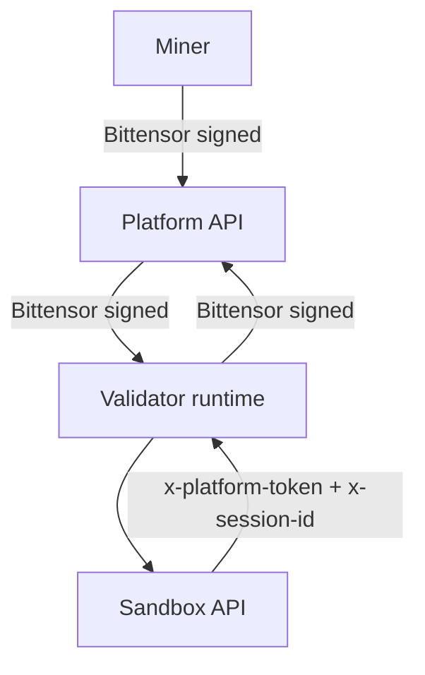

# Harnyx subnet HTTP APIs

This directory documents the **subnet-facing HTTP endpoints** which miners/validators interact with.

## Endpoint references (generated)
- Platform (miners/validators): [generated/platform.md](generated/platform.md)
- Validator: [generated/validator.md](generated/validator.md)
- Sandbox: [generated/sandbox.md](generated/sandbox.md)

> Note: `generated/platform.md` documents the broader subnet-facing Bittensor
> API surface. It is not the exact Gateway edge allowlist for `api.*`; the
> narrower `api.*` host/path contract is documented in the runtime and ops docs.

## Auth conventions used across services

- **Bittensor-signed requests**
  - `Authorization: Bittensor ss58="<ss58>",sig="<hex>"`
  - Signature is over canonical `{method, path+query, body}`.
- **Sandbox tool execution (auth + session context)**
  - Validator → Sandbox headers: `x-session-id` + `x-platform-token` + `x-host-container-url`
  - Sandbox → tool host (`POST /v1/tools/execute`) headers: `x-session-id` + `x-platform-token`
  - `/v1/tools/execute` body: `ToolExecuteRequestDTO` (`tool`, `args`, `kwargs`); session context is `x-session-id` header

## OpenAPI auth invariant

- If an endpoint has OpenAPI `security`, it is protected by that scheme.
- If OpenAPI `security` is missing/empty, the endpoint is public (`Auth: None.` in generated docs).

## Flows (sequence diagrams)
All Mermaid sequence diagrams live in [flows.md](flows.md), grouped by domain:

- Subnet runtime (Platform ↔ Validator ↔ Miner)
  - [flows.md#miner-script-upload](flows.md#miner-script-upload)
  - [flows.md#miner-task-batch](flows.md#miner-task-batch)
- Subnet ops (Platform ↔ Validator)
  - [flows.md#validator-registration-and-weights](flows.md#validator-registration-and-weights)

## Service interaction map

